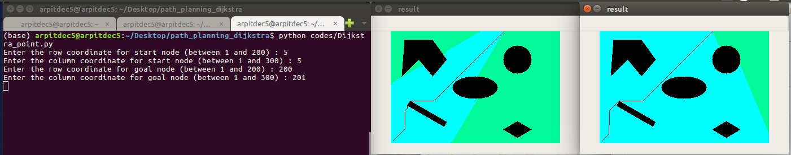

# Path Planning using Dijkstra Algorithm

[](LICENSE.md)
---


### Authors
Arpit Aggarwal Markose Jacob


### Introduction to the Project
In this project, the Dijkstra motion planning algorithm was used on a point robot and rigid robot to navigate in a configuration space consisting of static obstacles.


### Results

Comparison of Algorithms, A-star and Dijkstra (blue are the explored region):



### Software Required
To run the .py files, use Python 3. Standard Python 3 libraries like numpy, heapq and OpenCV are used.


### Instructions for running the code
To run the code for finding the path, follow the following commands:


```
cd codes
python Dijkstra_point.py
```


```
cd codes
python Dijkstra_rigid.py
```


### Credits
The following links were helpful for this project:
1. https://github.com/AtsushiSakai/PythonRobotics
